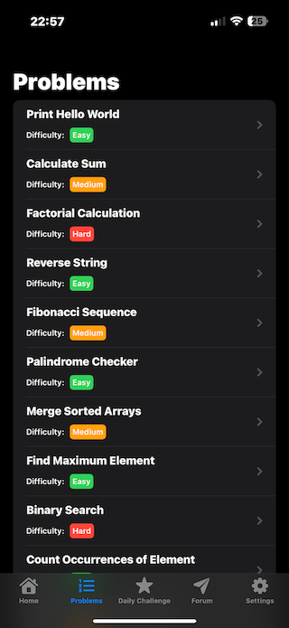
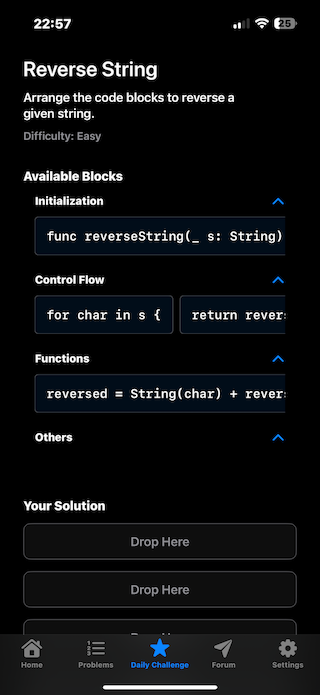

# CodeBuilder

Welcome to **CodeBuilder**! CodeBuilder is an educational iOS application designed to help users learn and practice coding skills in a fun and interactive way. The app provides a platform where users can solve coding problems by arranging code blocks, read educational articles, participate in daily challenges, and engage with a community through a built-in forum.

## Table of Contents
-	[Features](#features)
- [Requirements](#requirements)
- [Installation](#installation)
- [Usage](#usage)
- [App Structure](#app-structure)
- [Screenshots](#screenshots)
- [Technologies Used](#technologies-used)
- [License](#license)

## Features
- Interactive Problem Solving: Solve coding problems by dragging and dropping code blocks to build correct solutions.
- Daily Challenges: Tackle a new coding challenge every day to keep your skills sharp.
- Educational Articles: Access a library of articles covering fundamental programming concepts and algorithms.
- User Authentication: Sign up and log in securely using Firebase Authentication.
- Progress Tracking: Keep track of problems solved, streaks, and overall progress.
- Community Forum: Engage with other users by asking questions and sharing knowledge.
- User Profiles: Manage your account information and view your achievements.
- Responsive Design: Supports both light and dark modes with adaptive layouts.

## Requirements
- Xcode 15.0 or later
- iOS 17.0 or later
- Swift 5.9
- CocoaPods (for dependency management)
- Firebase Account (for authentication and database services)

## Installation
1. Clone the Repository
  ```bash
  git clone https://github.com/yourusername/CodeBuilder.git
  cd CodeBuilder
  ```

2. Install Dependencies
Ensure you have CocoaPods installed. If not, install it using:
  ```bash
  sudo gem install cocoapods
  ```
Install the required pods:
  ```bash
  pod install
  ```
3. Open the Project
Open the workspace file in Xcode:
```bash
open CodeBuilder.xcworkspace
```
4. Configure Firebase
- Create a new project in the Firebase Console.
- Add an iOS app to your Firebase project.
- Download the GoogleService-Info.plist file and add it to your project in Xcode.
- Enable Email/Password authentication in the Firebase Console.
- Enable Firestore Database and set the appropriate security rules.

## Usage
1.	Build and Run
  - Select a simulator or connect a device, then build and run the project from Xcode.
2.	Sign Up or Log In
  - Create a new account using your email and a password.
  - Alternatively, sign in if you already have an account.
3.	Explore Features
  - Home: View your progress and navigate to different sections.
  - Problems: Browse and solve coding problems.
  - Daily Challenge: Attempt the daily coding challenge.
  - Forum: Interact with the community by reading and creating posts.
  - Settings: Manage your account and app preferences.
 4.	Solve Problems
  - Drag and drop code blocks from the available blocks section to the solution area.
  - Check your solution and receive immediate feedback.
  - Read related articles to understand the concepts better.

## App Structure
- Models
  - Problem.swift: Defines the structure for coding problems.
- ViewModels
  - AuthViewModel.swift: Handles user authentication logic.
  - UserStatsViewModel.swift: Manages user statistics and progress.
  - ForumViewModel.swift: Manages forum data and interactions.
  - ProblemsData.swift: Loads and manages the list of coding problems.
-	Views
  - Authentication: SignInView.swift, SignUpView.swift
  -	Home: HomeView.swift, ArticleDetailView.swift, LearningView.swift, ResumeView.swift
  -	Problems: ProblemsView.swift, ProblemDetailView.swift
  - Forum: ForumView.swift, ComposePostView.swift, PostView.swift, ReplyView.swift
  - Components: Reusable views like CodeBlockView.swift, SearchBar.swift, AutoScroller.swift
  - Settings: SettingsView.swift, AccountView.swift
Utilities
  - BackgroundGradientModifier.swift: Applies a gradient background.
  - ColorExtensions.swift: Custom color definitions.
  - MenuItem.swift: Defines menu items for settings.
  - SplashScreenView.swift: Displays the splash screen.

## Screenshots
### Login Screen

### Home Screen

### Problems List

### Daily Challenge

### Forum


## Technologies Used
- SwiftUI: For building the user interface.
- Firebase: Authentication, Firestore database, and data storage.
- Combine: For managing asynchronous events.
- MarkdownUI: To render Markdown content in articles.
- CocoaPods: Dependency management.

## License

This project is licensed under the MIT License. See the [LICENSE](LICENSE) file for details.

---

Thank you for checking out CodeBuilder! We hope this tool aids in your journey to becoming a proficient coder. If you have any questions or feedback, feel free to reach out.
